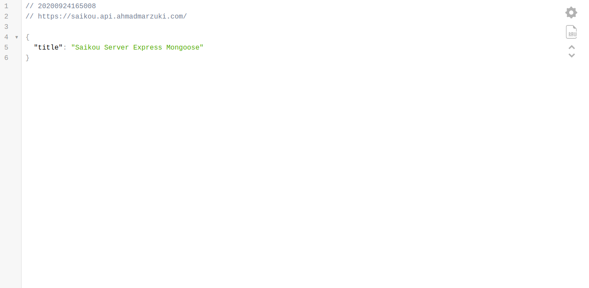

# Saikou

> _An alternative when myanimelist can't pleased your eyes_

Saikou is a complete web app (client) and API (server) built using MERN stacks which based on JavaScript.

|                             saikou-client                             |                               saikou-server                               |
| :-------------------------------------------------------------------: | :-----------------------------------------------------------------------: |
|  |  |

---

## Ideas

This project is intended to be the creation of **social media for anime & manga fans and communities**.
It will be the place for fans to share their interests each other.
It can be in the form of private chat, public discussion, reviews, recommendations, etc.

### Research

> Reverse engineer essential elements for a social community site.

Join these pop culture communities to identify the pros and cons from each of them.

- [MyAnimelist](https://myanimelist.net)
- [Anilist](https://anilist.co/)
- [Anime Planet](https://anime-planet.com)
- [kitsu.io](https://kitsu.io/explore/anime)
- [LINE OpenChat](https://line.me/ti/g2/d1YUYNUZ_tJDH0ywSe3VyQ)

API examples:

- [jikan.moe](https://jikan.docs.apiary.io/)
- [kitsu.io](https://kitsu.docs.apiary.io/)

References:

- [VIZ](https://www.viz.com/)
- [azobu web template](https://template.azobu.com)
- [YourStack](https://yourstack.com)

Misc:

- [Jurnal Otaku](http://jurnalotaku.com)
- [KAORI Nusantara](https://www.kaorinusantara.or.id)

## Features

### Features List

- User can register, login, and logout.
- User can have roles such as Regular or Admin.
- Admin credentials will be created once.
- Admin can add new anime/manga.
- Admin can edit anime/manga details.
- Admin can delete one or more anime/manga details.
- User can see available anime/manga collection.
- User can choose available avatar.
- User can read the details about one anime/manga.
- User can favorite and unfavorite one anime/manga.
- User can see other user's favorites of anime/manga.
- User can review a certain anime/manga.
- User can search an anime or manga.

### Future Features List

- Item can be linked between manga and anime in ItemDetail with a switch button or something similar.
- User can interact with other user through user profile and anime review.
- User have to confirm their email after registration.
- User can reset their password with reset link via email.
- User can show their amount of likes based on their published reviews and lists.
- User can see the list of characters or voice actors in the anime/manga.
- User can follow other users.
- User can create anime recommendation list.
- Hero background Image can be automatically randomized at certain timing.

### Not Features List

- User cannot watch anime episodes.
- User cannot read manga chapters.
- Anime cannot separated into multiple seasons. So only one franchise being shown or reviewed.

---

## UI/UX Design

### Mockup/Prototype

Figma: click [here](https://www.figma.com/file/j4lco2gQyoGtrY47DnzoTl/Saigo-no-Azobu)

### Pages

| Page                                 | Component       |
| ------------------------------------ | --------------- |
| `/`                                  | Home            |
| `/about`                             | About           |
| `/anime`                             | AnimeCollection |
| `/anime/:id/:slug`                   | Anime           |
| `/anime/:id/:slug/reviews`           | AnimeReviews    |
| `/manga`                             | MangaCollection |
| `/manga/:id/:slug`                   | Manga           |
| `/manga/:id/:slug/reviews`           | MangaReviews    |
| `/search`                            | Search          |
| `/register`                          | Register        |
| `/login`                             | Login           |
| `/logout`                            | Logout          |
| `/users/:id/:username`               | UserProfile     |
| `/users/:id/:username/reviews`       | UserReviews     |
| `/users/:id/:username/reviews/:slug` | UserReview      |
| `/users/:id/:username/lists`         | UserLists       |
| `/users/:id/:username/lists/create`  | UserListCreate  |
| `/users/:id/:username/lists/:slug`   | UserList        |
